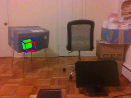

# Augmented Reality in Marker and Markerless environments

For an overview of both the projects please have a look at [Overview.pdf](Overview.pdf)

## ArUco Marker Tracking

Overlay virtual objects on ArUco markers using OpenCV ArUco marker tracking functions and Unity. For more information see [marker_ar/README.md](marker_ar/README.md)

  

<!--  -->

## Markerless AR using point cloud data

Overlay virtual objects on user selected points using surface normals computed from point cloud data. Point cloud data is acquired using [Intel's depth camera](https://www.intel.com/content/www/us/en/architecture-and-technology/realsense-overview.html). For more information see [markerless_ar/README.md](markerless_ar/README.md)

  

<!--  -->