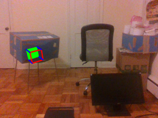

# Markerless AR using point cloud data

Overlay virtual objects on user selected points using surface normals computed from point cloud data. Point cloud data is acquired using [Intel's depth camera](https://www.intel.com/content/www/us/en/architecture-and-technology/realsense-overview.html)

## Requirements
* [Intel RealSense SDK 2.0 (v2.44.0)](https://www.intelrealsense.com/sdk-2/)
* OpenCV 4.5.0

## Setup